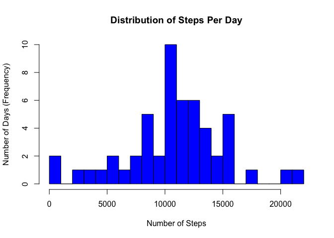
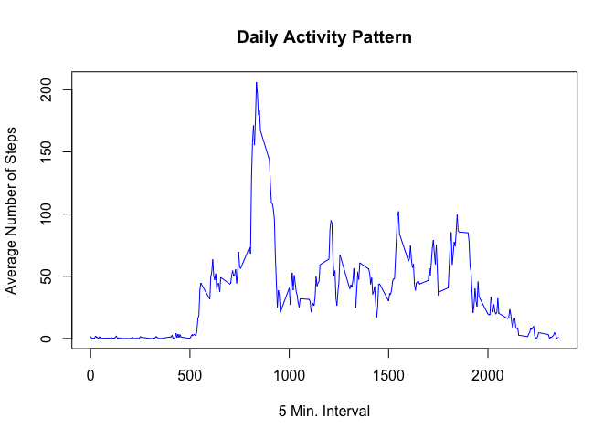
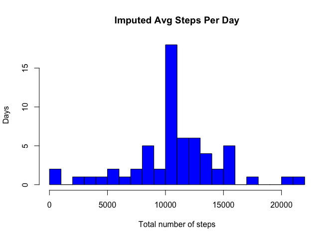
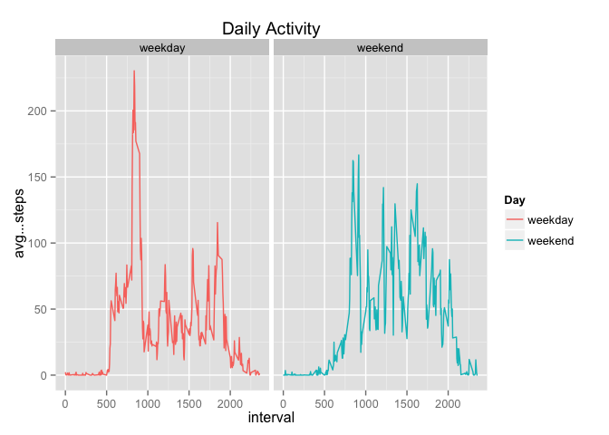

# Reproducible Research
Chris Hartner  
July 14, 2015  


Reproducible Research - Peer Assessment 1
---
Introduction
---
It is now possible to collect a large amount of data about personal movement using activity monitoring devices such as a Fitbit, Nike Fuelband, or Jawbone Up. These type of devices are part of the “quantified self” movement - a group of enthusiasts who take measurements about themselves regularly to improve their health, to find patterns in their behavior, or because they are tech geeks. But these data remain under-utilized both because the raw data are hard to obtain and there is a lack of statistical methods and software for processing and interpreting the data.

This assignment makes use of data from a personal activity monitoring device. This device collects data at 5 minute intervals through out the day. The data consists of two months of data from an anonymous individual collected during the months of October and November, 2012 and include the number of steps taken in 5 minute intervals each day.


Available data
---
The data for this assignment can be downloaded from the course web site:

**Dataset**: Activity monitoring data [Activity monitoring data](https://d396qusza40orc.cloudfront.net/repdata%2Fdata%2Factivity.zip) [52K]

The variables included in this dataset are:

* steps: Number of steps taking in a 5-minute interval (missing values are coded as NA)

* date: The date on which the measurement was taken in YYYY-MM-DD format

* interval: Identifier for the 5-minute interval in which measurement was taken

The dataset is stored in a comma-separated-value (CSV) file and there are a total of 17,568 observations in this dataset.

Analysis
---
Loading and preprocessing the data


```r
activity <- read.csv("/Users/Billy/Desktop/coursera/activity.csv")
```

What is mean total number of steps taken per day?
===
For this part of the assignment, you can ignore the missing values in the dataset.

* Make a histogram of the total number of steps taken each day

* Calculate and report the mean and median total number of steps taken per day


```r
library(dplyr)
```

```
## 
## Attaching package: 'dplyr'
## 
## The following objects are masked from 'package:stats':
## 
##     filter, lag
## 
## The following objects are masked from 'package:base':
## 
##     intersect, setdiff, setequal, union
```

```r
test <- activity %>% 
        group_by(date) %>%
        summarise(total= sum(steps)) 

mean(test$total, na.rm=T)
```

```
## [1] 10766.19
```

```r
median(test$total, na.rm=T)
```

```
## [1] 10765
```

```r
options(scipen=1, digits=2)

hist(test$total, main= "Distribution of Steps Per Day", 
     xlab="Number of Steps",
     ylab="Number of Days (Frequency)", breaks= 20, col="blue")
```

 

###Ignoring NA's:   

**mean**   10766.19   
**median** 10765.


What is the average daily activity pattern?
===
* Make a time series plot(i.e. type="l") of the 5-minute interval (x-axis) and the average number of steps taken averaged across all days (y-axis).
* Which 5-minute interval, on average across all the days in the dataset, contains the maximum number of steps?


```r
test1 <- activity %>% 
        group_by(interval) %>%
        summarise(avg..steps = mean(steps, na.rm=TRUE))

filter(test1, avg..steps==max(avg..steps))
```

```
## Source: local data frame [1 x 2]
## 
##   interval avg..steps
## 1      835        206
```

```r
plot(test1$interval, test1$avg..steps, type="l",
     main= "Daily Activity Pattern", 
     xlab= "5 Min. Interval", 
     ylab="Average Number of Steps",
     col="blue")
```

 

The **interval** with the max steps is **835** with the **maximum number of steps**: **206**.


Imputing missing values
===
Note that there are a number of days/intervals where there are missing values (coded as ‘NA’). The presence of missing days may introduce bias into some calculations or summaries of the data.

* Calculate the total number of missing values in the dataset (i.e. the total number of rows with NA’s)
* The daily average for that interval will be used to replace the NA's in a new dataset 
* Compare the new dataset with the first one created (ignoring NA's)
    


```r
na <- sum(is.na(activity))

rawact <- activity

rawact <- rawact %>%
        mutate(steps = ifelse(is.na(steps), test1$avg..steps, steps))

test2 <- rawact %>%
        group_by(date) %>%
        summarise(total1 = sum(steps))

hist( test2$total1,
      main="Imputed Avg Steps Per Day",
      xlab="Total number of steps",
      ylab="Days", breaks= 20, col="blue")
```

 

###Replacing NA's

There are **2304 NA's** that were replaced with the average. The adjusted mean and median are

**mean** 10766.19   
**median** 10766.19   


Imputing missing data with the average for that data did not change the mean, however, since there are more values closer to the mean (i.e. an additional 2304) the median is also closer and in fact equal to the mean.  Imputing data in this dataset had minimal effect.  

Are there differences in activity patterns between weekdays and weekends?
===
For this part the weekdays() function may be of some help here. Use the dataset with the filled-in missing values for this part.

* Create a new factor variable in the dataset with two levels – “weekday” and “weekend” indicating whether a given date is a weekday or weekend day.

* Make a panel plot containing a time series plot (i.e. type = "l") of the 5-minute interval (x-axis) and the average number of steps taken, averaged across all weekday days or weekend days (y-axis).


```r
library(ggplot2)

rawact$date <- as.Date(rawact$date)

nwraw <- rawact %>% 
        mutate(Day = as.factor(ifelse(weekdays(date)
                                      %in%c("Saturday", "Sunday"), "weekend", "weekday")))


test3 <- nwraw %>%
        group_by(Day, interval) %>%
        summarize(avg...steps = mean(steps))

ggplot( test3, aes(interval, avg...steps, color=Day)) +
        geom_line(aes(group=Day)) +
        ggtitle("Daily Activity") +
        facet_wrap(~Day)
```

 

###Differences
The weekday activity (Monday - Friday) had a higher number of steps earlier in the morning as opposed to the weekend, however, the weekends had a higher overall number of steps taken.  The difference is an increased level of activity on the weekends.
